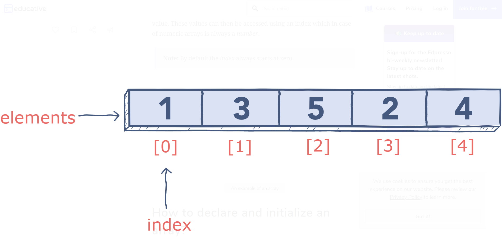
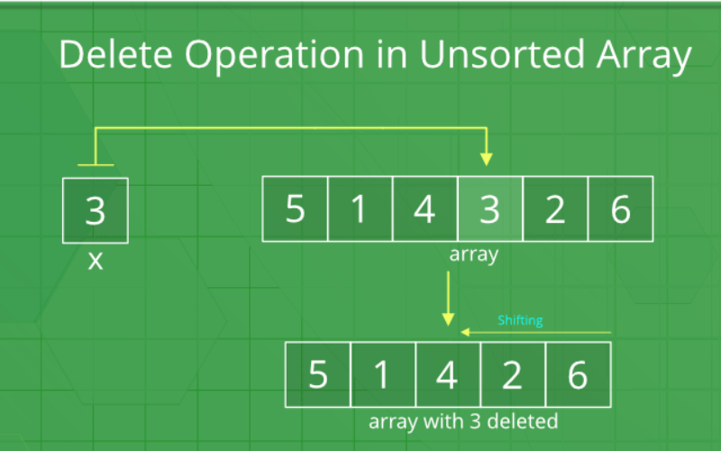
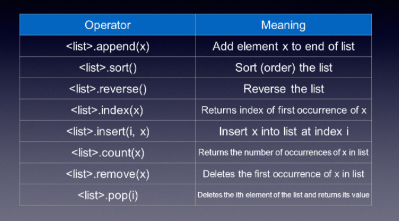

# Array Data Structure.

* Array is linear data structure.
* It is a contigious block of a memory which store data of similar type.
* Access an element by specifying position between 0 to n (length of the array).

In this image we have stored integer (data type) and accessing elements by its index (position of the element in array) :

### Insertion and Deletion Of Element From Array :  
* Since it a contigious block of memory insertion and deletion leads distortion in existing elements (shifting of elements).
* Because of this it took linear time.
* insertion and deletion time complexity O(N).

### Accessing Element :
* Array store element of same data type.
* Because of same data type we can access element in contant time.
* Time complexity O(1)

### Traversal of Array :
#### Linear Search :
                    Iterate over each item of array and check its existing. Time complexity is linear time O(N).
#### Binary Search :
    * Elements must be sorted in nature.
    * On each iteration it halves the length of the array.
    * Time complexity O(NLog(N)).

### Array Manipulation in Python : 
Python contain list(dynamic array) as a array.

#### len(array) :
    get the length of the array.

#### array_name[its_index] : 
    get the element of position its_index.
#### array.sort(reverse = True) :
    * Sort an array In-Place.
    * By default reverse is False.
    * By default it sort an array in ascending order.
#### variable_name = sorted(array) : 
    Sort an array in new position.

### Common Operations : 

